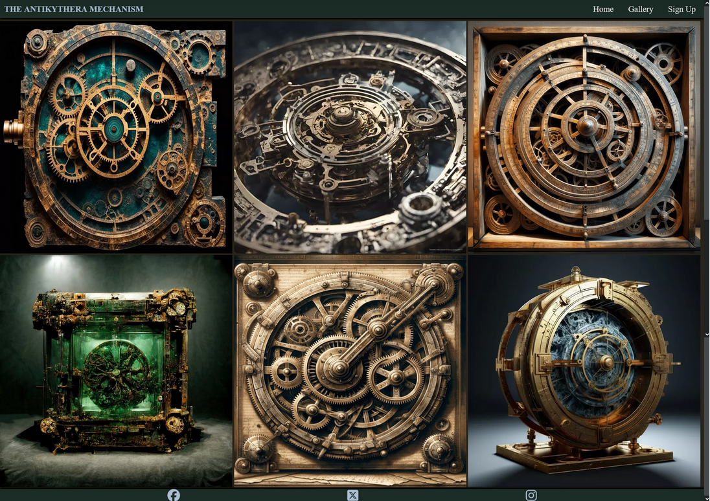
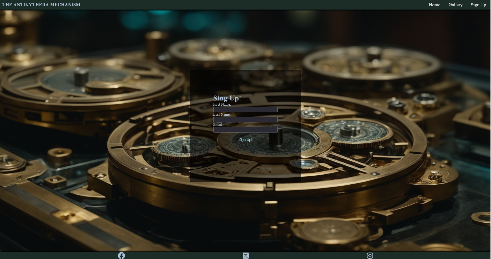

# Antikythera-Mechanism

Welcome to **The Antikythera mechanism.**

The Antikythera mechanism is a website design for people intrested in the oldest known example of an ancient Greek analog computing device used to predict astronomical positions and eclipses. The Antikythera Mechanism is famous for its intricate design and remarkable precision, dating back to around 100 BCE.

Users of the site can find information about the antikythera mechanism, images and sign up for future information.

[View the live project here](https://namlex.github.io/antikythera-mechanism)

## Features

At the top of the page on the left you can find the logo of the website and the name of the website The Antikythera mechanism that links to the top of the page. 

The other navigation links are on the right: Home, Gallery, Sign Up which link to the different pages.

The header shows the name of the website and provides information about the website.

In the Body of the home page you cand find information about the antikythera mechanism and a picture with the fragments of the mechanism.

In the footer you can find icons that redirect you to the social media pages.

The gallery page has six pictures with the Antikythera mechanism.

The sing up page has a form to collect details from people that want more information about the artifact.

The form collects the first name, last name and email address.

The footer section includes links to relevant social media sites for Antikythera mechanism.
The links will open to a new tab to allow easy navigation for the user.

### Testing

I tested that this website works in different browsers: Firefox, Chromium.

I confirmed that this project is responsive, looks good and fucntions on all screen sizes using the devtools device toolbar.

I confirmed that the navigation, header, gallery, sing up text are readable and easy to understand.

I confirmed that the form works: requires entries in every field and the submit button works.

#### Validator testing 

HTML
No errors were returned when passing through the official W3C validator

CSS
No errors were returned when passing through the official Jigsaw validator

Accessibility 

I confirmed that the colors and fonts chosen are easy to read and accessible by running it through lighthouse in devtools.

##### Deployment 

The site was deployed to GitHub pages. The steps to deploy are as follows:
  In Github repository, nvigate to Settings tab
  From the source section drop_down menu, select Main Branch
  Once the main branch has been selected, the page will be automatically refreshed
  with a detailed ribbon to indicate the successfull deployment

[View the live project here](https://namlex.github.io/antikythera-mechanism)

[View the githup repo here](https://github.com/NaMlex/antikythera-mechanism)

##### Credits
Content
The text for the Home Page was taken from Wikipedia
Instructions on how to implement the form validation sign up was taken from the Code Institute [Love Running Project](https://github.com/Code-Institute-Solutions/love-running-v3/tree/main/8.1-testing-and-validation)

The icons from the footer were taken from [Font Awesome](https://fontawesome.com/)

